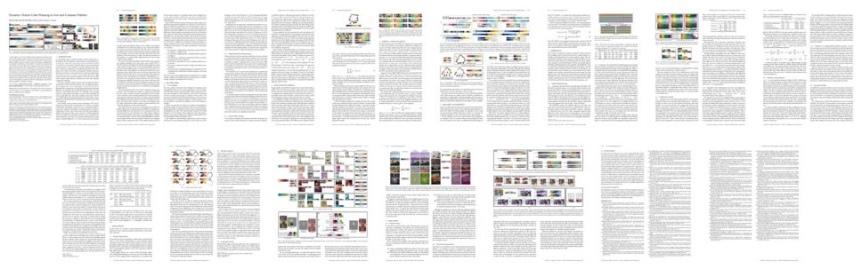

DCCW Dataset
===

  

## Abstract

We evaluate [DCCW](https://github.com/SuziKim/DCCW) using three different datasets for each purpose.

| Name | Purpose | 
|------|---------|
| [FM100P](FM100P/README.md) | Evaluation of the single palette sorting |
| [KHTP](KHTP/README.md) | Evaluation of the palette pair sorting |
| [LHSP](LHSP/README.md) | Evaluation of the palette similarity measurement |
| [Perceptual Study](perceptual-study/README.md) | Perceptual Study |


## Publication

Our paper is available at [ACM Digital Library](https://doi.org/10.1145/3450626.3459776).  


Please cite with the following Bibtex code:  

```bibtex
@article{kim2021dynamic,
    title = {Dynamic Closest Color Warping to Sort and Compare Palettes},
    author = {Kim, Suzi and Choi, Sunghee},
    year = {2021},
    journal = {ACM Transactions on Graphics (Proceedings SIGGRAPH)},
    volume = {40},
    number = {4},
    articleno = {95},
    pages  = {1--15},
    address = {New York, NY, USA},
    doi = {10.1145/3450626.3459776},
}
```

You may also want to refer to our publication with the more MLA style:  
*Kim, Suzi, and Sunghee Choi. "Dynamic Closest Color Warping to Sort and Compare Palettes." ACM Transactions on Graphics (TOG) 40.4 (2021)*


## Acknowledgements
This work was supported by [Institute of Information & communications Technology Planning & Evaluation (IITP)](https://www.iitp.kr/) grant funded by the Korea government(MSIT) (No.2019-0-01158, Development of a Framework for 3D Geometric Model Processing)


## Contact
Contributions are always welcome! Don't heasitate to leave a question and issue on this [github repo](https://github.com/SuziKim/DCCW/issues). Alternatively, drop us an e-mail at <mailto:kimsuzi@kaist.ac.kr>.
