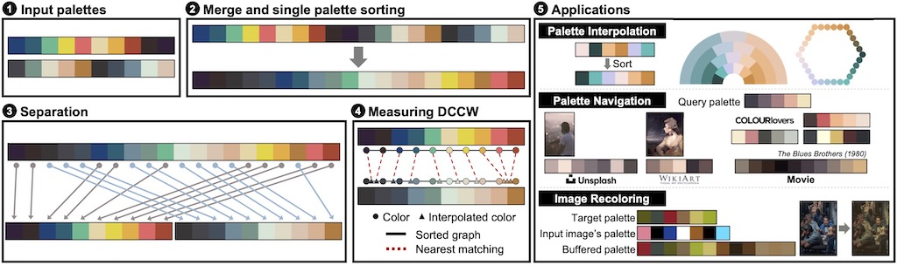

DCCW Dataset
===

  

We evaluate DCCW using three different datasets for each purpose.

| Name | Purpose | 
|------|---------|
| [FM100P](FM100P/README.md) | Evaluation of the single palette sorting |
| [KHTP](KHTP/README.md) | Evaluation of the palette pair sorting |
| [LHSP](LHSP/README.md) | Evaluation of the palette similarity measurement |


## Publication
Our paper is available at [ACM Digital Library](https://doi.org/10.1145/3450626.3459776). Please cite with the following Bibtex code:  

```bibtex
@article{kim2021dynamic,
    title = {Dynamic Closest Color Warping to Sort and Compare Palettes},
    author = {Kim, Suzi and Choi, Sunghee},
    year = {2021},
    journal = {ACM Transactions on Graphics (Proceedings SIGGRAPH)},
    volume = {40},
    number = {4},
    articleno = {95},
    address = {New York, NY, USA},
    doi = {10.1145/3450626.3459776},
}
```

## Acknowledgements
This work was supported by [Institute of Information & communications Technology Planning & Evaluation (IITP)](https://www.iitp.kr/) grant funded by the Korea government(MSIT) (No.2019-0-01158, Development of a Framework for 3D Geometric Model Processing)
